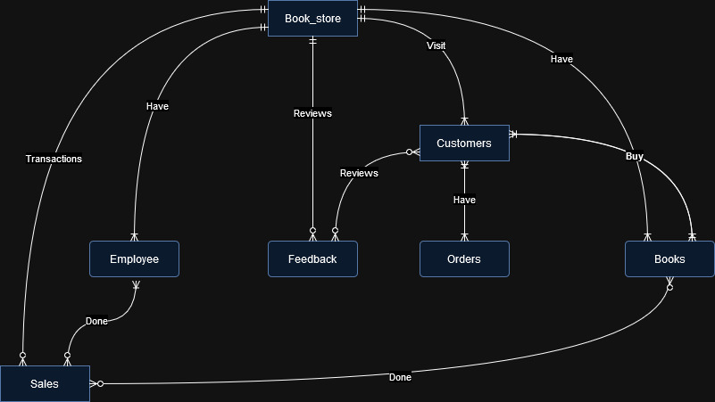

# Design Document

Luqman Ilman Muhammad

Video overview: <https://youtu.be/emhz4vkmDew>

## Scope

* The current CS50 SQL database is designed to manage a small bookstore called "Lq's Bookstore" Which the database includes several tables that are relevant to the scope of the business such as:

* Customers : to identifying information about customers like name, phone number, and address.
* Book_store : information for the store such as location, working days, and reviews about store.
* Store_items : this table is for giving information for customer to knowing about price,stock, and name of the items
* Orders : the table list of every made by customer along with the date
* Order_type : which contain order type like buy offline or online
* Employee : this table is represent about the employee of this store with column name, job title, salary, and personal information
* Sales : including details of items sold, quantity, date and sale price, and customer name who made the transaction
* Feedback : which includes several column such as evaluation of business, product and employee they interacted with.

## Functional Requirements

This database will support :

* CRUD operations for the bookstore
* to store all items with category
* record purchase and sell
* maintain transactions
* customer satisfaction
* record of all items product

## Representation

### Entities

The database includes the following entities :

### Customers
In Table of `Customers` includes :

*   `id`: Specifies the unique identifier for each customer. It is of type INTEGER and serves as the PRIMARY KEY for the table.
*   `first_name`: Represents the first name of the customer. It is of type TEXT and stores textual data.
*   `last_name`: Represents the last name of the customer. It is of type TEXT and stores textual data.
*   `phone_number`: Stores the phone number of the customer. It is of type TEXT and stores textual data.
*   `address`: Stores the address of the customer. It is of type TEXT and stores textual data.
*   `zip_code`: Stores the zip code of the customer's address. It is of type INTEGER and stores numerical data.

### Book_store
This table includes the shop identities such as:

*   `id`: This column specifies the unique identifier for each bookstore. It is of type INTEGER and serves as the PRIMARY KEY for the table.
*   `name`: This column stores the name of the bookstore. It is of type TEXT and stores textual data.
*   `reviews`: This column stores the number of reviews for the bookstore. It is of type INTEGER and stores numerical data.
*   `address`: This column stores the address of the bookstore. It is of type TEXT and stores textual data.
*   `zip_code`: This column stores the zip code of the bookstore's address. It is of type INTEGER and stores numerical data.
*   `work_days`: This column stores the working days of the bookstore. It is of type TEXT and stores textual data.

### Store_items

In `Store_Items` give the information of item identities, as such:

*   `id`: This column specifies the unique identifier for each store item. It is of type INTEGER and serves as the PRIMARY KEY for the table.
*   `name`: This column stores the name of the store item. It is of type TEXT and stores textual data.
*   `type`: This column stores the type of the store item. It is of type TEXT and stores textual data.
*   `price`: This column stores the price of the store item. It is of type REAL and stores floating-point numerical data.
*   `stock`: This column stores the quantity of the store item in stock. It is of type INTEGER and stores numerical data.

### Orders
Table represents customer's request

*   `id`: This column specifies the unique identifier for each order. It is of type INTEGER and serves as the PRIMARY KEY for the table.
*   `customers_id`: This column stores the ID of the customer who placed the order. It is of type INTEGER and serves as a FOREIGN KEY referencing the `id` column in the `Customers` table.
*   `items_id`: This column stores the ID of the item that was ordered. It is of type INTEGER and serves as a FOREIGN KEY referencing the `id` column in the `Store_items` table.
*   `date`: This column stores the timestamp of when the order was placed. It is of type DATE and stores date values.

### Order_type
contain customer's service details :
*   `id`: This column specifies the unique identifier for each order type. It is of type INTEGER and serves as the PRIMARY KEY for the table.
*   `order_id`: This column stores the ID of the order associated with the order type. It is of type INTEGER and serves as a FOREIGN KEY referencing the `id` column in the `Orders` table.
*   `order_type`: This column stores the type of service for the order. It is of type TEXT and stores textual data.
Table has 1 PRIMARY KEY `id` and 1 FOREIGN KEY id with references

### Employee
employee personal information:
*   `id`: This column specifies the unique identifier for each employee. It is of type INTEGER.
*   `first_name`: This column stores the first name of the employee. It is of type TEXT and stores textual data.
*   `last_name`: This column stores the last name of the employee. It is of type TEXT and stores textual data.
*   `job_title`: This column stores the job title of the employee. The data type is not specified in your description, so you may want to specify it as TEXT or VARCHAR.
*   `salary`: This column stores the salary of the employee. It is of type INTEGER and stores numerical data.
*   `hire_date`: This column stores the date when the employee was hired. It is of type DATE and stores date values.
*   `phone_number`: This column stores the phone number of the employee. It is of type INTEGER
table has 1 primary key

### Sales
*   `id`: This column specifies the unique identifier for each sale. It is of type INTEGER and serves as the PRIMARY KEY for the table.
*   `order_type_id`: This column stores the ID of the order type associated with the sale. It is of type INTEGER and serves as a FOREIGN KEY referencing the `id` column in the `Order_type` table.
*   `items_id`: This column stores the ID of the item sold. It is of type INTEGER and serves as a FOREIGN KEY referencing the `id` column in the `Store_items` table.
*   `price`: This column stores the price of the item sold. It is of type REAL and stores floating-point numerical data.
*   `amount`: This column stores the quantity of the item sold. It is of type INTEGER and stores numerical data.
*   `sales_date`: This column stores the date when the sale occurred. It is of type DATE and stores date values.
*   `employee_id`: This column stores the ID of the employee associated with the sale. It is of type INTEGER and serves as a FOREIGN KEY referencing the `id` column in the `Employee` table.

also this table has 1 PRIMARY KEY `id`, and 3 FOREIGN KEY with references

### Feedback
this for evaluation of customer product and service:

*   `id`: This column specifies the unique identifier for each feedback entry. It is of type INTEGER and serves as the PRIMARY KEY for the table.
*   `customers_id`: This column stores the ID of the customer who provided the feedback. It is of type INTEGER and serves as a FOREIGN KEY referencing the `id` column in the `Customers` table.
*   `employee_id`: This column stores the ID of the employee associated with the feedback. It is of type INTEGER and serves as a FOREIGN KEY referencing the `id` column in the `Employee` table.
*   `items_id`: This column stores the ID of the item related to the feedback. It is of type INTEGER and serves as a FOREIGN KEY referencing the `id` column in the `Store_items` table.
*   `reviews`: This column stores the evaluation or review provided by the customer. It is of type INTEGER and stores numerical data.
*   `store_shop_id`: This column stores the ID of the store associated with the feedback. It is of type INTEGER and serves as a FOREIGN KEY referencing the `id` column in the `Book_store` table.
table has 1 PRIMARY KEY `id`, and 4 FOREIGN KEY id with references from where derived.

### Relationships

The entity Relationship diagram below describes the relationship between entity in the database.

As detailed by the diagram:
* Book Store can have many employees, but an employee can only work at one book store;
* Book store can sell many different types of books, and each book is sold in one book store;
* One or many customers cacn visit the book store;
* book store might have zero or many reviews, also zero or more sales transactions can be done;
* One customer can place many orders, or it can be many to many, placed by many customers and many orders;
* zero or many customers can give zero or one review, apparently zero or one review could have been done by one customer;
* An order can contain many books and a book can be included in many orders, or many orders can have many books;
* An employee might have done zero or many sales transactions, at the same time zero or many done by many Employee;

(er Diagram
    BOOK_STORE||--|{ Employee : have
    BOOK_STORE||--|{ BOOK :have
    BOOK_STORE||--|{ CUSTOMERS: visit
    BOOK_STORE||--o{ FEEDBACK: reviews
    BOOK_STORE||--o{ SALES : transactions
    CUSTOMERS ||--|{ ORDERS : have
    CUSTOMERS }|..|{ IRDERS : have
    ORDERS }|--|| BOOK : buy
    ORDERS ||--|{ BOOK : buy
    ORDERS }|..|{ BOOK : buy
    CUSTOMERS }o--o{ FEEDBACK : reviews
    CUSTOMERS ||--o| FEEDBACK : reviews
    EMPLOYEE }|--o{ SALES : done
    EMPLOYEE ||--o{ SALES : done
    BOOK}o--o{ SALES : done

## Optimizations

A view has been crafted to offer insights into the availability of items, focusing on the "id", "name", "type", and "stock" attributes from the Item table.

CREATE VIEW "check_item_availability" AS
SELECT id,name,type,stock FROM Store_Items
WHERE stock IS NOT NULL;

Another view has been formulated to present the highest-rated products, emphasizing the "id", "name", "type", and "reviews" fields from the Store_Items table.

CREATE VIEW "top_reviewed" AS
SELECT id,name,type, reviews FROM Store_Items
ORDER BY reviews DESC;

-- Enhancing the efficiency of locating the highest-rated products, an index is established on the Store_Items table with columns "id", "name", "type", and "reviews".
CREATE INDEX item_reviews_index ON Store_items("id", "name", "type", "reviews");

-- Facilitating quick access to recent sales data, an index is constructed on the Sales table, encompassing columns "id", "items_id", "amount", and "sales_date".
CREATE INDEX recent_sales_index ON Sales("id", "items_id", "amount", "sales_date");

-- Optimizing retrieval operations, an index is set up on the Orders table, involving columns "id", "items_id", "date", and "customers_id".
CREATE INDEX orders_index_ ON Orders("id", "items_id", "date", "customers_id");

-- Providing efficient access to employee information, an index is created on the Employee table, including columns "id", "first_name", "last_name", "job_title", and "salary".
CREATE INDEX employee_index ON Employee("id", "first_name", "last_name", "job_title", "salary");

-- Streamlining the search process for delivered or pick-up orders, an index is established on the Order_type table, covering columns "id", "orders_id", and "order_type".
CREATE INDEX order_type_index ON Order_type("id", "orders_id", "order_type");

-- Improving the sorting of feedback reviews, an index is generated on the Feedback table, incorporating columns "id" and "reviews".
CREATE INDEX feedback_index ON Feedback("id", "reviews");

## Limitations

The existing schema exhibits a constrained set of tables and entities, potentially insufficient to fully encapsulate the diverse business processes and operations of the Bookstore. Consequently, there's a necessity to incorporate additional tables to document profit and tax timing for comprehensive annual revenue tracking, as well as to delineate job titles alongside their corresponding salaries. These expansions will ensure a more comprehensive representation of the Bookstore's functionalities and facilitate efficient management of its operations.
